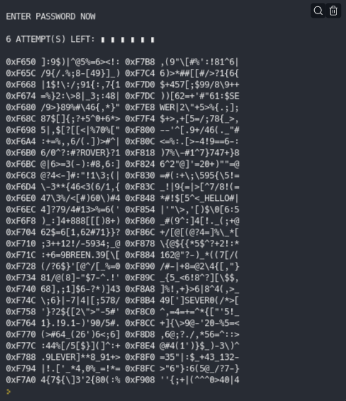

# Terminal-Bypass-Game

A simple game about early password cracking and access escalation set in the Citadel of City 17, as gordon freeman 
trys to crack open a combine terminal to gain access to Dr. Wallace Breen's office.

## Installation
This is assuming you have the latest version of python downloaded

1. Use the cd command to change to the directory where you want to install the game
2. Open terminal or powershell and type "git clone https://github.com/itzCozi/Terminal-Bypass-Game"
3. Then install the required packages by typing "pip install -r requirements.txt"
4. After that type "python .main" to run or make a terminal shim so you can use it in terminal or powershell

## Usage
How to use the game after installing it onto your PC

### Standard
After installation you should be able to play the game by opening the folder path in powershell or terminal 
then running "python main.py" to run it as a python program

### Terminal App
To be able to run the game directly from the terminal you must install [scoop](https://scoop.sh/)

1. Open the scoop folder in C:/users/YOUR_USER/scoop or C:/users/YOUR_USER/Programs/scoop
2. Then open the apps folder and add a new folder called terminal-bypass
3. After that drag all the files in the src folder into the new directory
4. Now copy the path of that folder and put it somewhere (Notepad or notepadqq)
5. Then go back to the scoop folder and open shims
6. make a new file and name it "bypass.cmd"
7. Open the file and type without parentheses (@"THE_COPIED_PATH.py"  %*)
8. Then save the file and open terminal and type "bypass" (Or whatever the .cmd is named) you should see the game
if not try again or make an issue

Hint: You can find the python .exe file in C:/users/YOUR_USER/Programs/python                                                                                   

### Check me out
Discord: BadDeveloper#4200                                                                                                                   
[Replit](https://replit.com/@cozi08/) | [Twitter](https://twitter.com/ransom_cooper)
